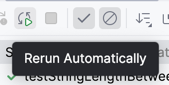

# If-statements
As programmers, we use if-statements daily, and there's nothing wrong with that, but it becomes a problem when they are used suboptimally.
What you sometimes see are complex nested if-statements that are hard to read, or even become unreadable.

What is nesting? Nesting is placing an if-statement inside another if-statement. Logic indented at different levels makes it more difficult to read the code.
The pitfall is to put a lot or all logic inside an if-statement, which causes all logic to be indented. That's not neat.

What you can do about this is invert the if-statement and/or introduce guard-clauses.

Example of inverting:

```java
if (condition) {
    // Many
    // lines
    // of
    // business
    // logic
} else {
   return ?;
}
```

converted to:

```java
if (!condition) {
   return ?;
}
// Many
// lines
// of 
// business
// logic
```

This way you prevent all business logic from being indented. In some cases, you will probably need to use guard-clauses.

# Guard-clauses
Guard clauses are conditional statements at the beginning of a method that immediately handle invalid input or situations.
You've probably seen them as ```Guard.argumentNotNull()``` or ```ObjectUtils.requireNonEmpty()```, but you can make them in all kinds of formats.

Example:

```java
public void process(String input) {
    if (input == null || input.isEmpty()) { // Guard clause
        throw new IllegalArgumentException("Input cannot be null or empty");
    }
    
    // Process the input
}
```

The advantage of guard-clauses is that they improve code readability by separating error handling logic from the main logic of the method.
This makes it clearer what the expected input is and what happens if that input does not meet expectations.


# Assignment

Remove all nesting from StringUtils while keeping all unit tests green.

**Extra challenge**: Do not make manual changes, but use IntelliJ's built-in refactor methods, such as Quick-Actions (⌥ + ENTER).

**Optional**: Turn on "Rerun Automatically" in the test runner, so you get immediate feedback after a refactor



